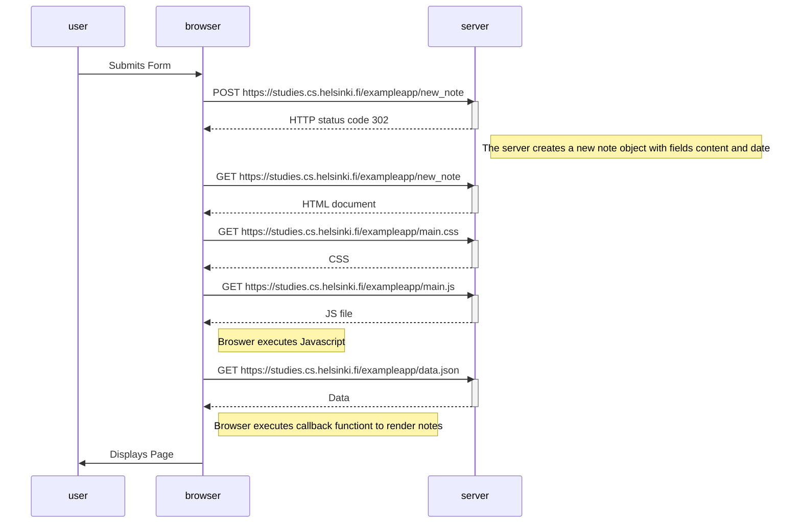

```mermaid
sequenceDiagram;
    participant user;
    participant browser;
    participant server;

    user->>browser: Submits Form;
    browser->>server: POST https://studies.cs.helsinki.fi/exampleapp/new_note;
    activate server;
    server-->>browser: HTTP status code 302;
    deactivate server;
    Note right of server: The server creates a new note object with fields content and date;
    
    
    browser->>server: GET https://studies.cs.helsinki.fi/exampleapp/new_note;
    activate server;
    server-->>browser: HTML document;
    deactivate server;
    
    browser->>server: GET https://studies.cs.helsinki.fi/exampleapp/main.css;
    activate server;
    server-->>browser: CSS
    deactivate server;
    
    browser->>server: GET https://studies.cs.helsinki.fi/exampleapp/main.js;
    activate server;
    server-->>browser: JS file;
    deactivate server;
    Note right of browser: Broswer executes Javascript;
    
    browser->>server: GET https://studies.cs.helsinki.fi/exampleapp/data.json;
    activate server;
    server-->>browser: Data;
    deactivate server;
    Note right of browser: Browser executes callback functiont to render notes;
    
    browser->>user: Displays Page;

```
