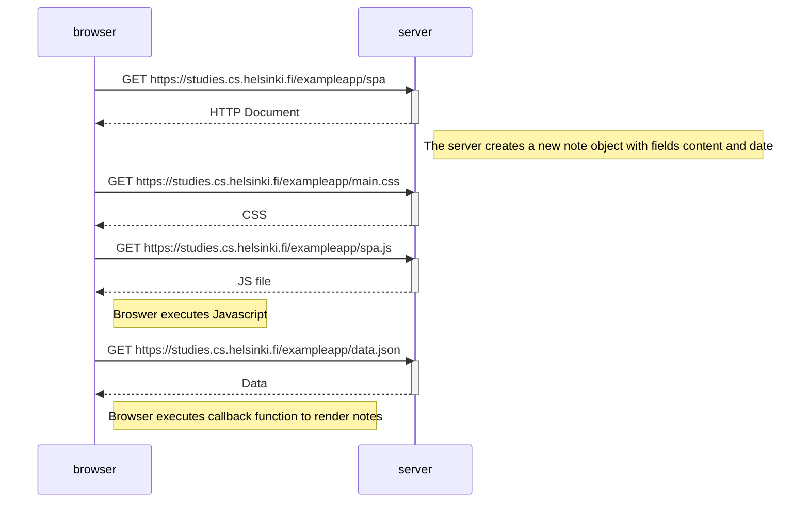

```mermaid
sequenceDiagram;
    participant browser;
    participant server;

    browser->>server: GET https://studies.cs.helsinki.fi/exampleapp/spa;
    activate server;
    server-->>browser: HTTP Document;
    deactivate server;
    Note right of server: The server creates a new note object with fields content and date;
    
    browser->>server: GET https://studies.cs.helsinki.fi/exampleapp/main.css;
    activate server;
    server-->>browser: CSS
    deactivate server;
    
    browser->>server: GET https://studies.cs.helsinki.fi/exampleapp/spa.js;
    activate server;
    server-->>browser: JS file;
    deactivate server;
    Note right of browser: Broswer executes Javascript;
    
    browser->>server: GET https://studies.cs.helsinki.fi/exampleapp/data.json;
    activate server;
    server-->>browser: Data;
    deactivate server;
    Note right of browser: Browser executes callback function to render notes;
    
    

```
